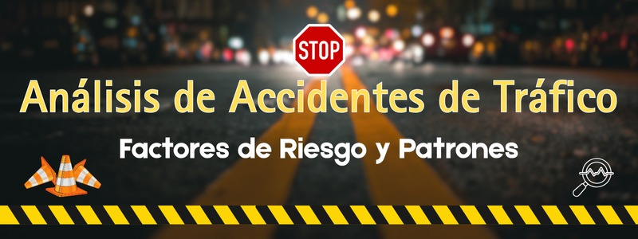

# Analisis de accidentes de trafico

**Autores**:Harver Alejandro Sierra García, Camilo Andrés Sanmiguel Uribe

**Objetivo** : Predecir la lesion mas grave ocurrida en un accidente dadas ciertas condiciones conocidas.

* [(Dataset)](https://www.kaggle.com/datasets/oktayrdeki/traffic-accidents/data): Contiene al rededor de 200 mil registros donde cada uno representa la ocurrencia de un accidente
* Librerias: numpy, pandas, sklearn, tensorflow
* Modelos: Clasificacion (GaussianNB, RFC, DNN)

[(Proyecto)](https://github.com/CamiloSanmiguel-2200922/Proyecto-IA1B1-prediccion-de-la-gravedad-en-accidentes-de-trafico);[(Video)](about:blank);[(+info)](https://github.com/CamiloSanmiguel-2200922/Proyecto-IA1B1-prediccion-de-la-gravedad-en-accidentes-de-trafico/blob/main/An%C3%A1lisis%20de%20Accidentes%20de%20Tr%C3%A1fico%20Factores%20de%20Riesgo%20y%20Patrones..pdf);